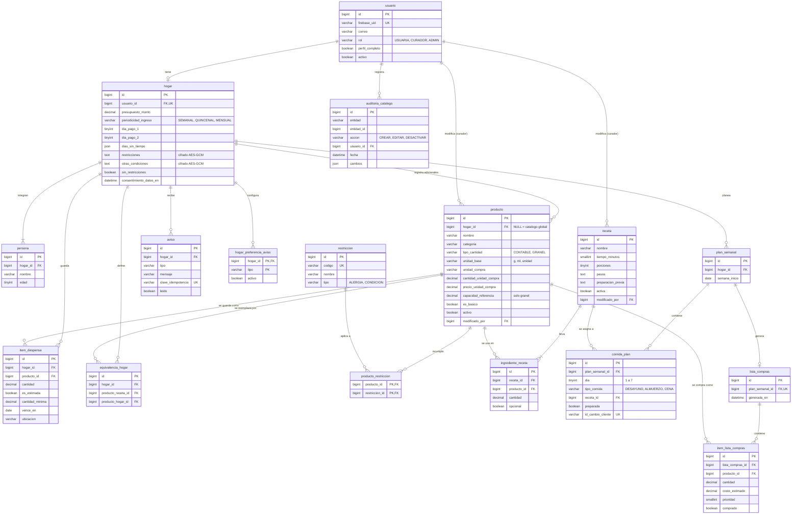

# Modelo de datos

Esquema de la base de datos de **Cocina sin estrés** (MySQL 8, InnoDB, utf8mb4). Lo crea la migración [`V1__esquema_inicial.sql`](../backend/src/main/resources/db/migration/V1__esquema_inicial.sql) (KAN-12) y responde a las decisiones ADR-13 a ADR-23.

17 tablas en 6 grupos:

| Grupo | Tablas | Proceso |
| --- | --- | --- |
| Identidad | `usuario` | 1. Usuario y autenticación |
| Perfil del hogar | `hogar`, `persona` | 1. Usuario y autenticación |
| Catálogo | `restriccion`, `producto`, `producto_restriccion`, `receta`, `ingrediente_receta`, `auditoria_catalogo` | 2 y 3, curaduría |
| Despensa | `item_despensa`, `equivalencia_hogar` | 2. Despensa virtual |
| Planificador | `plan_semanal`, `comida_plan`, `lista_compras`, `item_lista_compras` | 3. Planificador y recetario |
| Avisos | `aviso`, `hogar_preferencia_aviso` | 4. Notificaciones |

## Diagrama entidad-relación



## Reglas que aplica la base de datos

Además de llaves y tipos, el esquema rechaza estos datos inválidos con restricciones `CHECK` y `UNIQUE`:

| Regla | Dónde | ADR / RNF |
| --- | --- | --- |
| Un usuario tiene como máximo un hogar | `uk_hogar_usuario_id` | ADR-13 |
| El presupuesto es mayor que cero, y los días de pago corresponden a la periodicidad (semanal 1-7; mensual 1-31; quincenal dos días en orden) | `ck_hogar_presupuesto`, `ck_hogar_dias_pago` | ADR-14 |
| No se puede marcar "sin restricciones" y a la vez guardar restricciones | `ck_hogar_restricciones` | ADR-13, RNF-01 |
| Un producto a granel tiene capacidad de referencia; uno contable no | `ck_producto_capacidad` | ADR-15 |
| Todo producto del catálogo tiene precio de referencia completo y un curador responsable | `ck_producto_catalogo` | RNF-02, RNF-24 |
| Un producto aparece una sola vez en la despensa de un hogar | `uk_item_despensa_hogar_id_producto_id` | ADR-15 |
| Cantidades nunca negativas; ingredientes con cantidad mayor que cero | `ck_item_despensa_cantidades`, `ck_ingrediente_receta_cantidad` | RNF-02 |
| Una sola receta por día y comida en el plan | `uk_comida_plan_plan_semanal_id_dia_tipo_comida` | — |
| Un cambio reenviado por el navegador no se aplica dos veces | `uk_comida_plan_id_cambio_cliente` | ADR-21, RNF-17 |
| Un aviso repetido no se inserta | `uk_aviso_clave_idempotencia` | ADR-17 |
| Todo cambio del catálogo tiene un curador identificable | `auditoria_catalogo.usuario_id NOT NULL` | ADR-23, RNF-24 |
| Un curador con historia en el catálogo no se puede borrar, y un producto usado en una receta tampoco | Llaves foráneas sin cascada | ADR-23 |

## Qué pasa al borrar

- **Al eliminar una cuenta** (`usuario`), se borran en cascada su hogar y todo lo que depende de él: personas, despensa, productos adicionales, equivalencias, planes, comidas, listas de compras, avisos y preferencias.
- **El catálogo nunca se borra.** Productos, recetas y restricciones se desactivan (`activo = FALSE`), porque despensas, planes y la auditoría siguen apuntando a ellos.

## Lo que valida la aplicación, no la base de datos

- `hogar.restricciones` y `hogar.otras_condiciones` llegan cifradas (ADR-20). Por eso la base no puede validar que los códigos existan en `restriccion`, y lo hace el servicio de perfil antes de cifrar.
- Los ingredientes de una receta deben ser productos del catálogo global (`producto.hogar_id IS NULL`).
- Los campos obligatorios del perfil (RNF-01) se exigen al terminar el onboarding, cuando se marca `usuario.perfil_completo`.
- El nivel visible de un producto a granel (Lleno, Medio, Poco, Agotado) se calcula a partir de `cantidad / capacidad_referencia` en `domain/` (ADR-15). No se guarda.

## Para el backend (KAN-8)

- Las columnas de valores cerrados son `VARCHAR` con `CHECK`, no `ENUM` de MySQL. En JPA se mapean con `@Enumerated(EnumType.STRING)` y, si se usa `ddl-auto=validate`, también con `@JdbcTypeCode(SqlTypes.VARCHAR)`.
- Dinero en `BigDecimal` con escala 2; cantidades en `BigDecimal` con escala 3.
- Fechas y horas en UTC (`DATETIME(3)`). La conversión a America/Bogota se hace al mostrarlas.

## Cómo probarlo en tu computador

```bash
docker compose up -d mysql          # MySQL 8.4 en localhost:3306
bash scripts/probar-esquema.sh      # aplica V1 en una base temporal y corre 55 pruebas
```

El script crea la base `cocina_prueba`, aplica la migración, verifica la estructura, inserta datos válidos, intenta 27 operaciones inválidas que deben ser rechazadas, prueba el borrado en cascada de una cuenta y al final borra la base temporal. No toca `cocina_sin_estres`, que es la base de desarrollo; esa la llenará Flyway cuando exista el backend.
